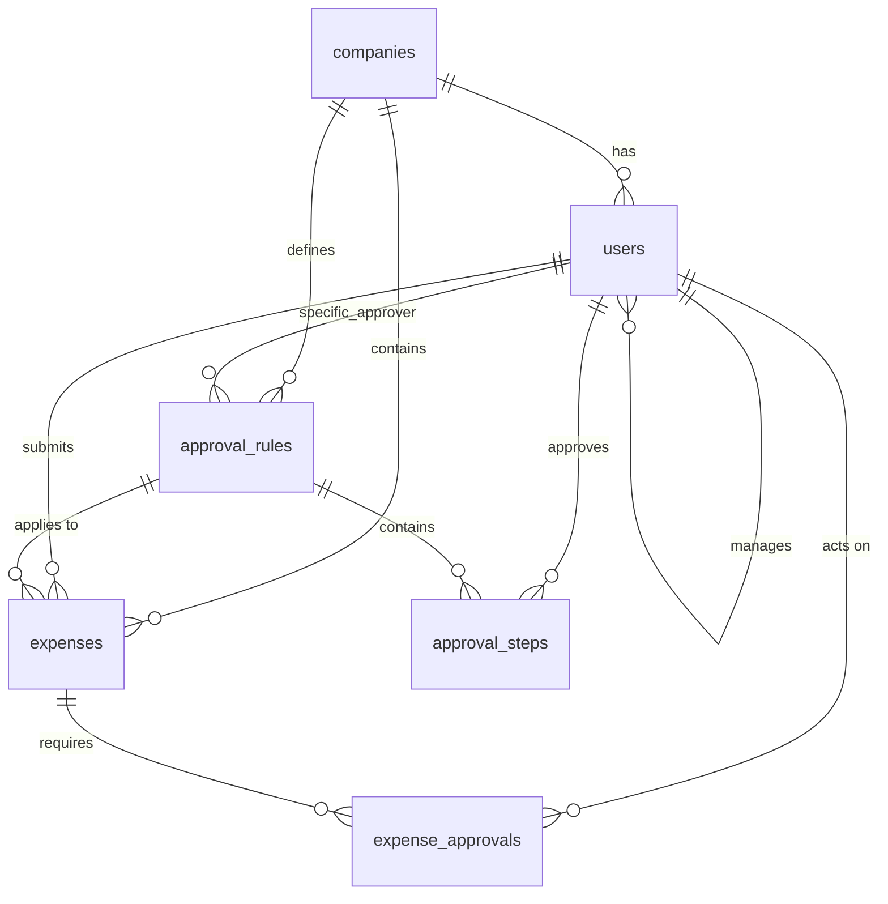

# Database Schema Documentation

This is the complete database schema for the ReimburX expense management system.

## Overview

The system uses PostgreSQL as the primary database with multi-tenant architecture. Each company's data is isolated using `company_id` foreign keys with cascade delete constraints.

## Tables

### 1. `companies`

Stores company information for multi-tenant isolation.

| Column | Type | Constraints | Description |
|--------|------|-------------|-------------|
| `id` | `SERIAL PRIMARY KEY` | - | Unique company identifier |
| `name` | `VARCHAR(255)` | `NOT NULL` | Company name |
| `country` | `VARCHAR(100)` | `NOT NULL` | Company country |
| `base_currency` | `VARCHAR(10)` | `NOT NULL` | Company's base currency (e.g., USD, EUR) |
| `created_at` | `TIMESTAMP` | `DEFAULT NOW()` | Record creation timestamp |

---

### 2. `users`

Stores user accounts with role-based permissions.

| Column | Type | Constraints | Description |
|--------|------|-------------|-------------|
| `id` | `SERIAL PRIMARY KEY` | - | Unique user identifier |
| `company_id` | `INTEGER` | `REFERENCES companies(id) ON DELETE CASCADE` | Company association |
| `full_name` | `VARCHAR(255)` | `NOT NULL` | User's full name |
| `email` | `VARCHAR(255)` | `UNIQUE NOT NULL` | User's email address |
| `password` | `VARCHAR(255)` | `NOT NULL` | Hashed password (bcrypt) |
| `role` | `VARCHAR(20)` | `NOT NULL DEFAULT 'employee' CHECK (role IN ('admin','director','manager','employee'))` | User role |
| `manager_id` | `INTEGER` | `REFERENCES users(id) ON DELETE SET NULL` | Manager reference for hierarchy |
| `is_manager_approver` | `BOOLEAN` | `DEFAULT false` | Whether this user can approve as manager |
| `profile_pic` | `TEXT` | `DEFAULT ''` | Profile picture URL |
| `created_at` | `TIMESTAMP` | `DEFAULT NOW()` | Record creation timestamp |

**Role Permissions:**
- `admin`: Full system access, user management, rule configuration
- `director`: Team management, expense approvals
- `manager`: Team expense approvals, team member views
- `employee`: Submit expenses, view own expenses

---

### 3. `expenses`

Stores expense reports and receipts.

| Column | Type | Constraints | Description |
|--------|------|-------------|-------------|
| `id` | `SERIAL PRIMARY KEY` | - | Unique expense identifier |
| `company_id` | `INTEGER` | `REFERENCES companies(id) ON DELETE CASCADE` | Company association |
| `submitted_by` | `INTEGER` | `REFERENCES users(id) ON DELETE CASCADE` | User who submitted the expense |
| `amount` | `NUMERIC(12,2)` | `NOT NULL` | Original expense amount |
| `currency` | `VARCHAR(10)` | `NOT NULL` | Original expense currency |
| `amount_in_base` | `NUMERIC(12,2)` | - | Amount converted to company base currency |
| `category` | `VARCHAR(100)` | `NOT NULL` | Expense category (e.g., travel, meals) |
| `description` | `TEXT` | - | Expense description |
| `expense_date` | `DATE` | `NOT NULL` | Date of expense occurrence |
| `receipt_url` | `TEXT` | - | URL to uploaded receipt image |
| `ocr_data` | `JSONB` | - | OCR extracted data from receipt |
| `status` | `VARCHAR(20)` | `DEFAULT 'draft' CHECK (status IN ('draft','submitted','pending','in_review','approved','rejected'))` | Expense status |
| `current_step` | `INTEGER` | `DEFAULT 1` | Current approval step number |
| `created_at` | `TIMESTAMP` | `DEFAULT NOW()` | Record creation timestamp |

**Status Flow:**
1. `draft` → `submitted` → `pending` → `in_review` → `approved`/`rejected`

---

### 4. `approval_rules`

Defines approval workflows for expenses.

| Column | Type | Constraints | Description |
|--------|------|-------------|-------------|
| `id` | `SERIAL PRIMARY KEY` | - | Unique rule identifier |
| `company_id` | `INTEGER` | `REFERENCES companies(id) ON DELETE CASCADE` | Company association |
| `name` | `VARCHAR(255)` | `NOT NULL` | Rule display name |
| `rule_type` | `VARCHAR(20)` | `NOT NULL CHECK (rule_type IN ('sequential','percentage','specific_approver','hybrid'))` | Type of approval rule |
| `percentage_threshold` | `NUMERIC(5,2)` | - | Minimum percentage for percentage-based rules |
| `specific_approver_id` | `INTEGER` | `REFERENCES users(id) ON DELETE SET NULL` | Specific approver for specific_approver rules |
| `created_at` | `TIMESTAMP` | `DEFAULT NOW()` | Record creation timestamp |

**Rule Types:**
- `sequential`: Steps must be approved in order
- `percentage`: Minimum percentage of approvers required
- `specific_approver`: Single specific approver
- `hybrid`: Combination of multiple rule types

---

### 5. `approval_steps`

Individual steps within approval rules.

| Column | Type | Constraints | Description |
|--------|------|-------------|-------------|
| `id` | `SERIAL PRIMARY KEY` | - | Unique step identifier |
| `rule_id` | `INTEGER` | `REFERENCES approval_rules(id) ON DELETE CASCADE` | Parent rule association |
| `step_order` | `INTEGER` | `NOT NULL` | Order of step in workflow |
| `approver_id` | `INTEGER` | `REFERENCES users(id) ON DELETE CASCADE` | Specific user approver |
| `approver_role` | `VARCHAR(50)` | - | Role-based approver (e.g., 'manager') |
| `created_at` | `TIMESTAMP` | `DEFAULT NOW()` | Record creation timestamp |

---

### 6. `expense_approvals`

Tracks individual approval actions for each expense.

| Column | Type | Constraints | Description |
|--------|------|-------------|-------------|
| `id` | `SERIAL PRIMARY KEY` | - | Unique approval identifier |
| `expense_id` | `INTEGER` | `REFERENCES expenses(id) ON DELETE CASCADE` | Associated expense |
| `approver_id` | `INTEGER` | `REFERENCES users(id) ON DELETE CASCADE` | User who performed action |
| `step_order` | `INTEGER` | `NOT NULL` | Which step this approval represents |
| `status` | `VARCHAR(20)` | `DEFAULT 'pending' CHECK (status IN ('pending','approved','rejected'))` | Approval status |
| `comment` | `TEXT` | - | Optional approval comment |
| `acted_at` | `TIMESTAMP` | - | When the action was performed |
| `created_at` | `TIMESTAMP` | `DEFAULT NOW()` | Record creation timestamp |

---

## Relationships

## Key Constraints and Indexes

### Foreign Key Constraints
- All tables reference `companies.id` for multi-tenant isolation
- Cascade delete ensures data consistency when companies are removed
- User hierarchy maintained through `manager_id` self-reference

### Check Constraints
- `users.role`: Limited to four specific roles
- `expenses.status`: Limited to six valid status values
- `expense_approvals.status`: Limited to three approval states
- `approval_rules.rule_type`: Limited to four rule types

### Data Integrity
- Email addresses are unique across all companies
- Amount fields use `NUMERIC(12,2)` for precise financial calculations
- Timestamps automatically track record creation
- JSONB field for flexible OCR data storage

## Multi-tenant Isolation

The schema enforces strict data isolation between companies:

1. **Company Scoping**: All business data tables include `company_id`
2. **Cascade Delete**: Removing a company removes all associated data
3. **Cross-company Prevention**: Foreign keys prevent data mixing between tenants
4. **Query Isolation**: Application layer ensures queries are always company-scoped

## Migration Notes

The system includes runtime migration logic to handle schema evolution:
- Adds missing columns for backward compatibility
- Removes deprecated columns safely
- Maintains data integrity during upgrades
- Supports both new and existing installations

## Performance Considerations

- **Indexes**: Primary keys automatically indexed
- **Foreign Keys**: Referenced columns should be indexed for join performance
- **JSONB**: OCR data uses PostgreSQL's efficient JSONB storage
- **Timestamps**: Default `NOW()` ensures consistent audit trails
- **Numeric Types**: Financial data uses precise decimal arithmetic
